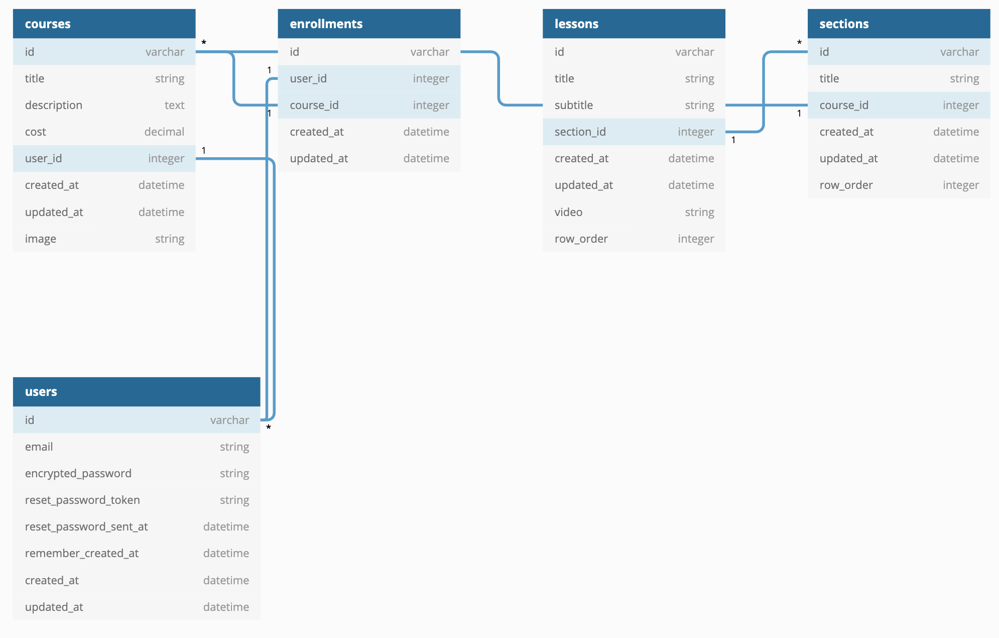

# flixter

An E-commerce Courses Platform!

This app powers flixter located [http://flixter-clark-ngo.herokuapp.com] (Heroku Project URL)

## Schema


## Getting Started

## Software requirements

- Rails 5.0.0 or higher

- Ruby 2.3.1 or higher

- PostgreSQL 9.3.11 or higher

## Create Account in GitHub and Heroku

<a href="https://github.com/">GitHub</a>

<a href="https://www.heroku.com/">Heroku</a>

## Setup your development environment (Mac)

Download vagrant files here: <a href="https://github.com/FirehoseProject/firehose-vagrant-rails5/raw/master/tools/vagrant.zip?raw=true">vagrant.zip</a>

Save to your Desktop

Unzip the file, it will create a folder called vagrant on your Desktop. This is where all your web development environment will live.

## Install Tools for development environment (Mac)

Go to the VirtualBox Website, click the link to Download "OS X hosts". Open the dmg file that downloads, then double click on VirtualBox.pkg that pops up and follow the instructions (you're clicking continue most of the time). Once you go through that step close out the "VirtualBox" window.

Go to the <a href="http://www.vagrantup.com/downloads.html">Vagrant Download</a> Page, click Find the Mac OS X section and click "Universal (32 and 64-bit)". Run the file you downloaded and follow the instructions (you're clicking next most of the time)

## Turn on your Web Dev environment

```
cd ~/Desktop/vagrant
vagrant up
vagrant ssh
```

## Accounts SSH Key

Generate SSH Key
Inside the web development terminal window, where it says [Web Dev] in blue, run the following lines one by one. important note: the command has backticks (`) not single-quotes ('), either copy and paste the command or if you type it use the key to the left of the 1 to type the backtick in the first line:
```
eval `ssh-agent -s`
ssh-keygen -t rsa -C "Firehose Vagrant" -N '' -f ~/.ssh/id_rsa
ssh-add ~/.ssh/id_rsa
```

## Configure Heroku with SSH Keys
update the heroku-cli with the following command:
```
wget -qO- https://cli-assets.heroku.com/install-ubuntu.sh | sh
heroku login
heroku keys:add
```

## Configure Github with SSH Keys
```
curl https://gist.githubusercontent.com/kenmazaika/fa8ea7dfbae413638cfd111b974bc74a/raw/ecb5e91c044d92389d0cfd3c2229e57187384d6d/github_auth.rb  > ~/.firehose-github.rb && ruby ~/.firehose-github.rb
git config --global user.email "you@example.com"
git config --global user.name "Your Name"
```

## Test
```
cd /vagrant/src/flixter
rails s -b 0.0.0.0 -p 3000
```

## Clone this repository
```
git clone git@github.com:clarkngo/flixter.git
```

## Navigate to the Rails application

```
$ cd flixter
```

## Create, migrate and seed the database

 ```
 $ rails db:create
 $ rails db:migrate
 $ rake db:seed
 ```

## Starting the local server

```
$ rails server

   or

$ rails s
```

## Production Deployment

  ```
  $ git push heroku master
  $ heroku run rake db:migrate
  ```

## Support

Bug reports and feature requests can be filed with the rest for the Ruby on Rails project here:

* [File Bug Reports and Features](https://github.com/clarkngo/flixter/issues)

## License

flixter is released under the [MIT license](https://mit-license.org).

## Copyright

copyright:: (c) Copyright 2018 Clark Jason Ngo. All Rights Reserved.
